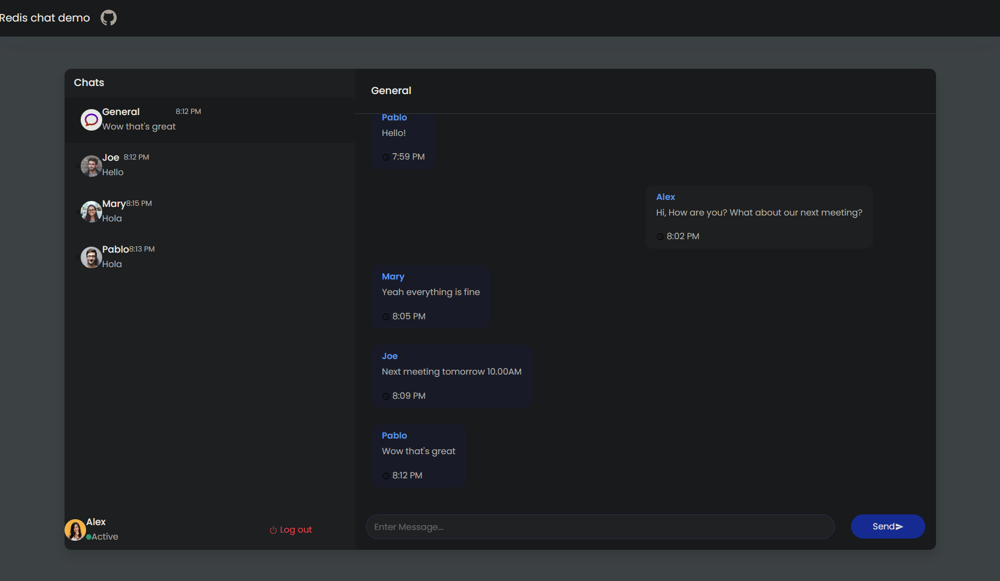

[](https://www.devzero.io/dashboard/recipes/new?repo-url=https://github.com/ScaleupInfra/dz-redis)

# Real-Time Chat Application in DZ Workspace Cluster with Redis

## Table of Contents
- [Real-Time Chat Application in DZ Workspace Cluster with Redis](#real-time-chat-application-in-dz-workspace-cluster-with-redis)
  - [Table of Contents](#table-of-contents)
  - [Project Overview](#project-overview)
  - [Objectives](#objectives)
  - [Tech Stack](#tech-stack)
    - [Backend](#backend)
    - [Frontend](#frontend)
    - [Infrastructure](#infrastructure)
  - [Architecture Diagram](#architecture-diagram)
  - [Project Structure](#project-structure)
  - [User Interface](#user-interface)
    - [Front-End](#front-end)
    - [Inventory Page](#inventory-page)
  - [Usage](#usage)
  - [Setup Kafka in Workspace](#how-to-setup-kafka-and-other-microservices-in-the-workspace)

## Project Overview
This project showcases Real-Time Chat Application deployed within a DevZero Workspace Cluster, leveraging Redis as both a caching mechanism and a message broker to facilitate seamless asynchronous communication among users, with a React-based frontend for responsive user interactions and Node.js-powered backend services ensuring efficient server-side processing and real-time capabilities, serving as an excellent starting point for developers to understand the integration of various technologies in building a real-time communication platform and demonstrating best practices in modern web application architecture.

We're utilizing DevZero's built-in infrastructure template to streamline and expedite the setup process, taking advantage of pre-configured tools like kubectl, Helm, Terraform, and others to easily set up Redis and integrate it with other services in our workspace, thereby eliminating the manual management overhead and enabling us to focus on efficiently building and deploying our application.

## Objectives
Scalable Infrastructure: Deploy the application in a DevZero Workspace Cluster to achieve scalability and high availability.
Event-Driven Architecture: Utilize Redis as a message broker to decouple services and enable asynchronous processing.
Modern Web Application: Develop a responsive and dynamic single-page application using React and JavaScript.

## Tech Stack
### Backend
1. Node.js: Handles API requests, business logic, and communicates with Redis using express-session and socket.io library.
2. Redis: Used for message brokering between microservices.
### Frontend
1. React: Builds the user interface for the e-commerce application.
2. JavaScript: Core programming language for frontend logic and interactivity.
### Infrastructure
1. Docker: Used for containerizing the application components.
2. Kubernetes: Manages containerized applications across multiple hosts.
3. Redis: Facilitates event-driven communication between microservices.

## Architecture Diagram


## Project Structure

```bash
real-time-chat-application
├── Redis-Chat-App/
│   ├── frontend/
│   │   ├── build/
│   │   └── react-app/
│   ├── backend/
│   │   ├── config.js
│   │   ├── demo-data.js
│   │   ├── index.js
│   │   ├── redis.js
│   │   └── util.js
│   ├── package.json
│   ├── package-lock.json
│   ├── repo.json
│   └── Dockerfile    
├── k8s/
│   ├── chat-app.yaml
│   └── redis.yaml
├── recipe.yaml
└── readme.md
```
1. Redis-Chat-App/backend/: Contains Node.js microservices for order and inventory management, along with Kafka producer and consumer.
2. Redis-Chat-App/frontend/: Contains the React SPA for the e-commerce platform.
3. k8s/: Kubernetes configuration files for deployments, services, and Redis setup.
4. recipe.yaml: Contains DevZero workspace configuration for creating a self-managed Redis and microservices pods.

## User Interface
### Frontend


## Usage

Once deployed, you can access the real-time chat application through the provided IP address or domain. The React SPA will communicate with the backend services, which are decoupled using Redis for message brokering using the publisher/subscriber model.

## How to Setup Redis and other microservices in the workspace

1. Create a new workspace in DevZero using the recipe **quickstart-infra**.
2. Connect to the workspace and create a new namespace:

    ```
    kubectl create namespace dz-redis
    ```

3. Change the context to the new namespace:

    ```
    kubectl config set-context --current --namespace=dz-redis
    ```

4. Clone this [repository](https://github.com/ScaleupInfra/dz-redis) and navigate to the folder:

    ```
    cd dz-redis
    ```

5. Run the kubernetes manifest files:

    ```
    kubectl apply -f k8s
    ```

6. Foward the port of the frontend deployment with the command:
    ```
    kubectl port-forward --address 0.0.0.0 deployment/redis-chat-app 8070:4000
    ```

7. Access the application on your browser by using the following link:

    ```
    http://<devzero-workspace-name>:8070
    ```

    > Replace the placeholder with your workspace name.

## Recipe

Use the following `recipe` configuration to create your own workspace.

``` yaml
# DevZero Redis Demo Chat Application Recipe
version: "3"

# Build Environment
build:
  steps:
    # Install Starter Packages
    - type: apt-get
      packages: ["build-essential", "curl", "git", "nano", "software-properties-common", "ssh", "sudo", "tar", "unzip", "vim", "wget", "zip"]
    # END
    # ----------------------------------------
    # Install Kubectl CLI tool
    - type: apt-get
      packages: ["curl"]
    - type: command
      command: |-
        curl -LO "https://dl.k8s.io/release/$(curl -L -s https://dl.k8s.io/release/stable.txt)/bin/linux/amd64/kubectl"
        install -o root -g root -m 0755 kubectl /usr/local/bin/kubectl && rm kubectl
      user: root
    # END
    # ----------------------------------------
    # Install Nodejs
    - type: command
      command: |-
        curl -o- https://raw.githubusercontent.com/nvm-sh/nvm/v0.39.1/install.sh | bash
        export NVM_DIR=$HOME/.nvm && [ -s $NVM_DIR/nvm.sh ] && \. $NVM_DIR/nvm.sh
        nvm install 21.0.0
      directory: /home/devzero
      user: devzero
    # END
    # ----------------------------------------
    # Clone the Repository
    - type: git-clone
      url: https://github.com/ScaleupInfra/dz-kafka
  
# Launch Environment
launch:
  steps:
    # Create the Namespace and apply the manifest files
    - type: command
      command: |
        if ! kubectl get ns dz-redis >/dev/null 2>&1; then
          kubectl create namespace dz-redis
          kubectl config set-context --current --namespace=dz-redis
          cd dz-redis
          kubectl apply -f k8s
        else
          echo "Namespace dz-redis already exists. Skipping steps."
        fi
    # END
```
